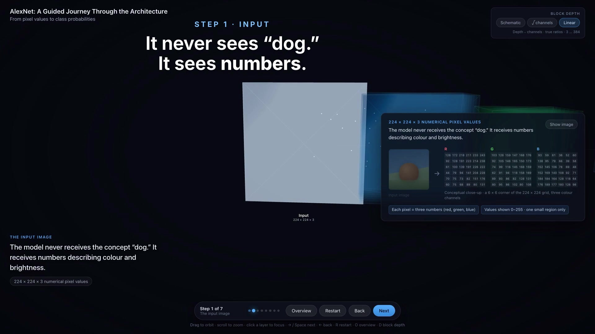

# AlexNet: A Guided Journey Through the Architecture

An interactive 3D visualization that explains how AlexNet turns an image into a
classification result. Built for a university Information Systems classroom: no
advanced mathematics, no training, no backend.

The experience is a guided camera tour through a 3D model of the network. The
audience first sees the whole architecture, then flies to each stage for a
concrete visual explanation.

[](brag-output/brag.mp4)

▶️ [Watch a short companion animation](brag-output/brag.mp4), a stylized visualization based on the 3D scene (not a recording of the app itself).

> **Nothing here is a trained model.** There is no inference and no real
> weights. Every feature map, activation grid and probability is a hand-designed
> illustration chosen to make the *mechanism* legible. See
> [Conceptual vs. paper numbers](#conceptual-vs-paper-numbers).

---

## Getting started

Requires Node.js 18 or newer.

```bash
npm install
npm run dev
```

Then open the URL Vite prints (by default <http://localhost:5173>).

Other commands:

```bash
npm run build     # production build into dist/
npm run preview   # serve the production build locally
```

### Presenting

- Run `npm run dev`, open the page, and press **F11** (or your browser's
  full-screen shortcut) before the session starts.
- The tour opens on the overview and needs no mouse. Use the arrow keys or the
  on-screen **Next** button.
- The layout scales up automatically on large displays and projectors
  (≥ 1800 px and ≥ 2400 px breakpoints), so text stays readable from the back
  of a lecture hall.

---

## Keyboard controls

| Key | Action |
| --- | --- |
| `→` or `Space` | Next step |
| `←` | Previous step |
| `R` | Restart tour (returns to the overview and replays every demo animation) |
| `O` | Overview (returns to the wide shot without resetting the demos) |
| `D` | Cycle block depth: schematic → √ channels → linear |

Keys are ignored while focus is in a button or text field, so tabbing to a
control and pressing `Space` activates that control rather than advancing the
tour.

All controls are reachable by `Tab` and have accessible labels. The narration
block and the step counter are `aria-live` regions, so step changes are
announced to screen readers.

### Mouse / trackpad

- **Drag** to orbit
- **Scroll** to zoom — zooming follows the pointer, so you can scroll straight
  into the input image or the output chart at either end of the model rather
  than always zooming toward the middle
- **Click a layer** to jump to the tour step that explains it

Manual exploration is optional. Guided mode is the default, and **Overview** or
`O` always restores it — camera controls are temporarily disabled during a
flight so a stray drag cannot interrupt a transition.

---

## The guided tour sequence

| Step | Title | What it shows |
| --- | --- | --- |
| Overview | Overview | The whole architecture from a wide angle, the colour legend, and the two GPU lanes |
| 1 | The input image | An image dissolving into labelled RGB pixel values |
| 2 | Conv1 and the 11 × 11 filter | An 11 × 11 filter sliding across a pixel grid with stride 4, writing one value per position into a feature map |
| 3 | Feature maps | Three representative filters producing three different feature maps from the same input |
| 4 | Pooling | A 3 × 3 max-pooling window moving with stride 2 over a 5 × 5 grid, giving a 2 × 2 output |
| 5 | Deeper convolutional layers | Conv2 → Conv5, with feature maps shrinking and growing more abstract |
| 6 | Dense layers | Final feature maps flattening into a vector that passes through FC6, FC7 and FC8 |
| 7 | Classification | FC8's 1,000 class scores, the softmax function, and the resulting 1,000 probabilities as an illustrative bar chart |

The progress indicator reads `Step 2 of 7`; the overview is step 0 and is
labelled `Overview` rather than numbered.

Steps 2 and 4 animate continuously. Step 2 also has **Play / Pause / Step**
controls and a filter switcher, so a presenter can advance the filter one
stride at a time while talking.

---

## Conceptual vs. paper numbers

Keeping these apart is the point of this section — please don't blur them when
presenting.

### From the AlexNet paper

These come from Krizhevsky, Sutskever & Hinton, *ImageNet Classification with
Deep Convolutional Neural Networks* (NeurIPS 2012), and are used consistently
throughout the app:

- Five convolutional layers, followed by three fully connected layers
- Input `224 × 224 × 3` (the paper's stated input size)
- Conv1 uses `11 × 11 × 3` filters with **stride 4**, and learns **96** filters
- Conv1 filters operate across all three RGB channels
- Max-pooling, using **overlapping** `3 × 3` windows with **stride 2**
- Three fully connected layers: **FC6** (4,096 units), **FC7** (4,096 units)
  and **FC8** (1,000 class scores)
- A final **1,000**-way output over ImageNet classes, produced by applying
  softmax to FC8's scores
- The original network was split across **two GPUs**
- Per-layer tensor shapes shown under each block (`55 × 55 × 96`,
  `27 × 27 × 256`, `13 × 13 × 384`, `6 × 6 × 256`, …)

### Softmax is not a fourth layer

This distinction is deliberate throughout the app, because it is the one most
easily lost in a diagram. The conceptual sequence is:

| Stage | What it is | What it produces |
| --- | --- | --- |
| Dense 1 / FC6 | learned layer | 4,096 units |
| Dense 2 / FC7 | learned layer | 4,096 units |
| Dense 3 / FC8 | learned layer | 1,000 class scores / logits |
| Softmax | **mathematical function, not a learned layer** | — |
| Class probabilities | result | 1,000 normalized probabilities |

Only the three FC layers have learned weights. Softmax is a fixed function with
no parameters, so the visualization never draws it as a column of neurons. In
the 3D scene it is a small grey wireframe block carrying a σ glyph and the note
*"not a learned layer"*, joined to its neighbours by dotted trails rather than
the solid links used between learned layers. The final probabilities are drawn
as a bar distribution, not as neurons either.

The wording used in the overview, the guided-tour step and the panel is the
same throughout: *"The final fully connected layer produces 1,000 class scores.
Softmax then converts these scores into probabilities."*

### Conceptual and simplified

Everything in this list is invented for teaching and is labelled as such in the
interface:

- **All feature maps and activation values.** Generated by small hand-written
  functions in [`src/lib/patterns.js`](src/lib/patterns.js) — an oriented
  derivative, a red/blue opponency and a checkerboard contrast detector. They
  are *not* activations from a trained AlexNet.
- **The input photograph** is a CSS illustration, not a real ImageNet image.
- **The pixel grids.** The input step shows an 8 × 8 corner and the Conv1 step a
  27 × 27 patch. Both carry a "Conceptual close-up" badge next to the grid and a
  caption naming the region size — they are never all 224 × 224 cells.
- **The pooling example** uses AlexNet's real geometry — a 3 × 3 window with
  stride 2 — on a small 5 × 5 activation grid, which gives a 2 × 2 output.
  Because the stride (2) is smaller than the window (3), neighbouring windows
  share a row and column; the demo outlines that shared band, which is what
  "overlapping" means. The grid size and the values in it are invented for
  teaching; the window and stride are the paper's.
- **The softmax probabilities** (dog 0.72, wolf 0.11, …) are illustrative and
  labelled "Illustrative softmax output".
- **The dense-layer connections** are a small sample, labelled "Representative
  connections shown". A real layer has millions.
- **3D geometry.** In the default *Schematic* mode, block sizes, spacing and the
  number of drawn planes are chosen for legibility and are not to scale. Each
  block shows the real tensor shape as a label.

  The **Block depth** toggle (or `D`) offers three mappings of the channel count
  onto block depth:

  | Mode | Depth | Trade-off |
  | --- | --- | --- |
  | **Schematic** (default) | hand-picked | Most legible; depth carries no data |
  | **√ channels** | `√channels` | Ordering exact, ratios compressed |
  | **Linear** | `∝ channels` | Ratios exact, input block nearly invisible |

  The channel counts span 3 (the RGB input) to 384 — a factor of 128 — which is
  more than a screen can show at once. In *Linear* mode the ratios are honest
  but the input image is 0.09 units deep, thinner than its own outline, and
  Conv2 through Conv4 all stretch into similarly long slabs that are hard to
  tell apart. *√ channels* trades exact ratios for visibility: the ordering
  3 < 96 < 256 < 384 is preserved and every block stays readable.

  In both scaled modes the spacing grows with the depths so blocks do not
  intersect, making the model roughly 1.7× longer, and the camera swings to a
  three-quarter view because depth is not readable head-on. Spatial dimensions
  (height and width) are never to scale in any mode.
- **The three filters in step 3** are representative examples, not the complete
  96-filter layer — stated on screen.

### Wording chosen carefully

Deeper layers are described as responding to *"more complex and object-related
patterns"*. The app never claims that Conv4 or Conv5 detects a specific object
part, and never implies the network understands objects the way people do; step
5 carries an explicit note to that effect.

Step 5's summary is worded *"As the network gets deeper, spatial dimensions
generally shrink, while the number of feature channels changes to support richer
representations."* The word **changes** is deliberate: channel counts do not
simply grow. In AlexNet they run 96 → 256 → 384 → 384 → 256, so Conv5 has fewer
channels than Conv4, and the per-layer dimensions shown in the app make that
visible.

The two-GPU split appears as two subtle lanes in the overview with the note
*"AlexNet was divided across two GPUs for computational reasons. Together, both
parts form one model."* It is historical context, not a focus of the tour, and
the lanes are hidden once the tour moves in on a layer.

---

## Accessibility

- `prefers-reduced-motion: reduce` is respected: camera flights cut directly to
  their destination, the floating and particle motion stops, and the animated
  demos render in their final state. CSS transitions are neutralised too.
- All buttons are real `<button>` elements, keyboard reachable, with
  `aria-label`s that mention the keyboard shortcut and `aria-pressed` on toggles.
- Step changes announce through `aria-live="polite"` regions.
- Pixel grids, feature maps and charts carry `role="img"` with descriptive
  `aria-label`s, so they are not silent to assistive technology.
- Focus styles are visible (`:focus-visible` outlines) against the dark theme.

---

## Project structure

```
src/
  App.jsx                          tour state, keyboard handling, layout
  main.jsx                         entry point
  styles.css                       dark cinematic theme, projector scaling
  lib/
    architecture.js                layer + tour data model, palette, paper figures
    patterns.js                    deterministic conceptual pattern generators
    useReducedMotion.js            prefers-reduced-motion hook
  components/
    ArchitectureScene.jsx          the R3F canvas, lighting, GPU lanes, connectors
    LayerNode.jsx                  one stage: plane stack or neuron column + label
    CameraTour.jsx                 eased camera + orbit-target flights
    DataFlow.jsx                   glowing data-flow particles (single draw call)
    FilterConvolutionDemo.jsx      step 2: 11 × 11 filter, stride 4
    FeatureMapDemo.jsx             step 3: three filters, three feature maps
    PoolingDemo.jsx                step 4: max-pooling
    DeepLayersDemo.jsx             step 5: the abstraction ladder
    DenseLayerDemo.jsx             step 6: flatten + dense connections
    SoftmaxOutput.jsx              step 7: illustrative probabilities
    TourControls.jsx               presentation control bar
```

Two components differ in name from a purely conceptual reading: the
input/feature-map step components are `InputImageDemo` and `FeatureMapDemo`, and
the deeper-layers step is `DeepLayersDemo`. `DataFlow` is an extra component
holding the particle stream.

The tour is data-driven: each step in `TOUR` in
[`src/lib/architecture.js`](src/lib/architecture.js) declares its camera
framing, which layers stay lit, its headline and which demo panel to show. To
reorder, reword or re-frame a step, edit that array — no component changes
needed.

## Tech stack

React 18, React Three Fiber 8 and drei 9 (the matching stable pair for React
18), Three.js, Vite. All assets are local and procedural; there is no backend,
no network request at runtime and no image files to ship.
